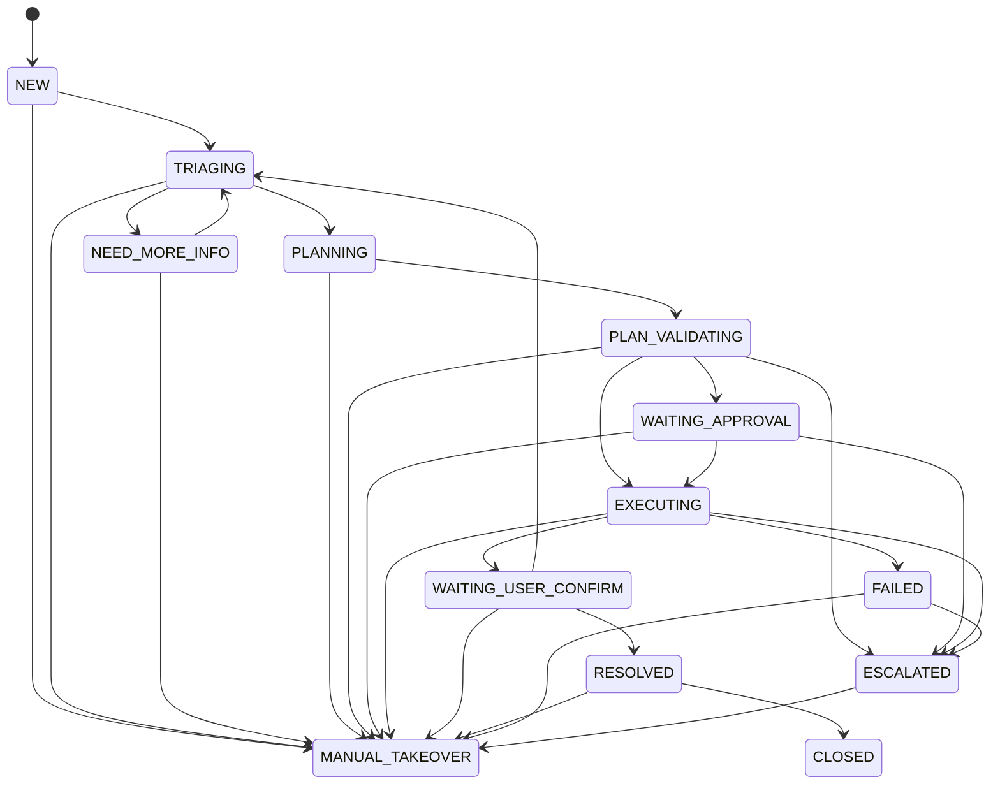

# ITOps Agent

一个面向企业 IT 服务台场景的工单编排项目。当前仓库已经完成 `Phase 2`，并已统一收口到 `Spring Boot + MyBatis-Plus + MySQL + Pydantic + pytest` 这一套技术栈，具备工单状态机、审计追踪、Agent 意图理解、槽位抽取、缺失信息追问与结构化上下文持久化能力。

## 当前状态

- 当前阶段：`Phase 2`
- 当前定位：可运行的工单分诊与上下文理解最小闭环
- 当前技术状态：Java / Python 两侧都已切换到统一技术栈，不再混用 `JPA`、`Hibernate`、`H2`、`unittest` 等旧方案
- 已实现：
  - 工单创建、列表、详情、状态流转
  - 状态历史与审计日志
  - 基于 `MyBatis-Plus` 乐观锁的并发保护
  - Agent 意图识别、槽位抽取、缺失字段追问与二次理解
  - `conversation_message`、`ticket_context`、`agent_step_log` 持久化
  - 前端静态页面展示工单、对话记录、结构化上下文、节点日志与状态历史
  - Python Agent Runtime 骨架与 `Pydantic` 输出契约
- 暂未实现：
  - 真实 LLM 接入
  - SOP 检索与执行计划生成
  - 工具执行链路、审批恢复、消息队列编排

## 技术栈

### Java 侧

- Java 21
- Spring Boot 3.5
- Spring Web MVC
- MyBatis-Plus 3.5.14
- MySQL 8
- Lombok
- Maven
- JUnit 5

### Python 侧

- Python 3
- Pydantic
- pytest

## 核心能力

### 工单闭环

- 创建工单
- 查询工单列表
- 查询工单详情
- 发起状态流转
- 用户补充信息并触发 Agent 重新分析

### Agent 理解与上下文

- 自动识别 `ACCOUNT_LOGIN_ISSUE`、`VPN_CONNECTION_ISSUE`、`PERMISSION_REQUEST`、`UNKNOWN`
- 自动抽取 `employeeId`、`targetSystem`、`deviceType`、`permissionLevel` 等关键槽位
- 缺少关键信息时生成 Agent 追问并写入对话记录
- 用户补充消息后自动重新执行 `classify_intent -> extract_slots -> generate_question`
- 将结构化结果写入 `ticket_context`
- 将用户与 Agent 消息写入 `conversation_message`
- 将每个 Agent 节点输出写入 `agent_step_log`

### 前端控制台

- 创建工单并立即查看详情
- 查看工单结构化上下文、缺失槽位与风险级别
- 查看用户/Agent 对话记录
- 查看 Agent 节点日志
- 提交补充信息
- 提交状态变更

### Python Agent Runtime

- 提供 `LLM Client` 抽象与 `MockLLMClient`
- 提供 `classify_intent`、`extract_slots`、`generate_question` 三个节点
- 提供 `ContextBuilder`
- 优先尝试构建 `LangGraph` 工作流，未安装时回退到顺序执行器
- 所有节点输出统一通过 `Pydantic` 模型校验

### 状态机约束

- 仅允许规则内的状态迁移
- 非法状态流转会被拒绝
- 角色权限约束已生效：`EMPLOYEE`、`IT_ENGINEER`、`APPROVER`、`ADMIN`

### 审计与并发保护

- 每次状态变更都会写入状态历史
- 审计日志记录操作者、目标对象与上下文细节
- 基于 `MyBatis-Plus` 乐观锁避免并发覆盖更新

## 状态流转概览



## 快速开始

### 环境要求

- JDK 21
- Maven 3.8+
- MySQL 8
- Python 运行环境：`D:/anaconda3/envs/lc/python.exe`

### 数据库准备

项目默认连接以下本地 MySQL：

- 地址：`127.0.0.1:3306`
- 数据库：`itops_agent`
- 用户名：`root`
- 密码：`123456`

如本地配置不同，请修改 `src/main/resources/application.properties`。

建库示例：

```sql
CREATE DATABASE IF NOT EXISTS itops_agent
  CHARACTER SET utf8mb4
  COLLATE utf8mb4_unicode_ci;
```

### 启动项目

Windows：

```bash
.\mvnw.cmd spring-boot:run
```

macOS / Linux：

```bash
./mvnw spring-boot:run
```

启动后可访问：

- 页面：`http://127.0.0.1:8080/`
- 工单列表接口：`GET http://127.0.0.1:8080/api/tickets`

### 运行测试

Java 测试：

```bash
.\mvnw.cmd clean test
```

Python 测试：

```bash
D:/anaconda3/envs/lc/python.exe -m pytest
```

## API 概览

### 创建工单

`POST /api/tickets`

示例请求：

```json
{
  "title": "VPN 无法连接",
  "description": "员工在公司外网环境下无法连接 VPN",
  "creatorId": "u1001",
  "creatorRole": "EMPLOYEE",
  "priority": "HIGH"
}
```

### 查询工单列表

`GET /api/tickets`

### 查询工单详情

`GET /api/tickets/{ticketId}`

返回结果除工单基础字段外，还会携带：

- `ticketContext`
- `conversationMessages`
- `agentStepLogs`
- `statusHistory`

### 补充工单信息

`POST /api/tickets/{ticketId}/messages`

### 变更工单状态

`POST /api/tickets/{ticketId}/status`

示例请求：

```json
{
  "targetStatus": "TRIAGING",
  "actorId": "it-2001",
  "actorRole": "IT_ENGINEER",
  "expectedVersion": 0,
  "comment": "开始受理并进入初步分诊"
}
```

### Agent 上下文读取

`GET /api/agent/context/{ticketId}`

### Agent 上下文写入

`POST /api/agent/context/{ticketId}`

## 数据模型

当前 Phase 2 使用以下核心表：

- `ticket`
- `ticket_status_history`
- `audit_log`
- `conversation_message`
- `ticket_context`
- `agent_step_log`

初始化脚本：

- `src/main/resources/db/migration/V1__ticket_state_machine.sql`
- `src/main/resources/db/migration/V2__ai_context.sql`

## 项目结构

```text
src/main/java/com/itops/itopsagent
├── config/        Spring 配置类
├── controller/    控制层与全局异常处理
├── dto/           请求与响应对象
├── entity/        实体与枚举
├── interceptor/   拦截器
├── mapper/        MyBatis-Plus 持久层接口
├── service/       业务接口
├── service/impl/  业务实现
└── utils/         工具类与异常
```

项目约束见：

- `AGENTS.md`
- `CLAUDE.md`

## 测试覆盖

当前已覆盖以下关键测试：

- 状态机合法流转与非法流转校验
- 角色权限限制
- 并发状态更新冲突
- 审计日志与状态历史持久化
- Agent 意图识别、槽位抽取与缺失字段追问评估
- 控制层集成测试
- Python Agent Runtime 的工作流与节点输出校验

最近一次本地验证结果：

- `mvn clean test`：14 个测试全部通过
- `D:/anaconda3/envs/lc/python.exe -m pytest`：3 个测试全部通过

## 后续方向

- SOP 检索与候选计划生成
- 真实 LLM 与工具调用链路接入
- 审批恢复与人工接管编排增强
- 异步任务与幂等控制
