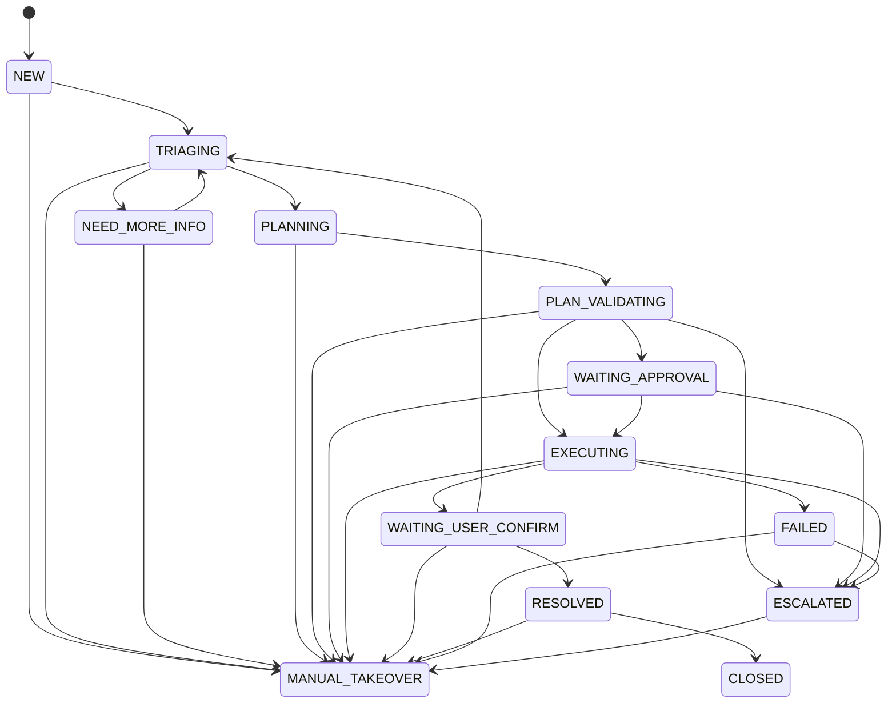

# ITOps Agent

一个面向企业 IT 服务台场景的工单编排项目。当前仓库已经完成 `Phase 5`，在 `Spring Boot + MyBatis-Plus + MySQL + Pydantic + pytest` 统一技术栈上，已经具备工单状态机、审批闭环、Agent 理解、SOP 检索、Candidate Plan 生成，以及 Java Harness 的异步工具执行、幂等与审计治理能力。

## 当前状态

- 当前阶段：`Phase 5`
- 当前定位：可演示的端到端 MVP，支持审批恢复执行、用户确认关闭和前端时间线回放
- 当前技术状态：Java / Python 两侧都已切换到统一技术栈，不再混用 `JPA`、`Hibernate`、`H2`、`unittest` 等旧方案
- 已实现：
  - 工单创建、列表、详情、状态流转
  - 状态历史与审计日志
  - 基于 `MyBatis-Plus` 乐观锁的并发保护
  - Agent 意图识别、槽位抽取、缺失字段追问与二次理解
  - 10 条结构化 SOP seed、Qdrant 兼容检索与候选计划生成
  - Java Harness Plan 预校验与异步执行接口
  - `tool_call_log`、`idempotency_record` 持久化
  - `approval_task` 审批任务持久化、审批通过恢复执行、审批拒绝升级人工
  - 内存版 RabbitMQ / Redis 语义适配器，用于锁定异步执行与幂等契约
  - `conversation_message`、`ticket_context`、`agent_step_log` 持久化
  - 前端静态演示台展示工单、对话记录、结构化上下文、计划、审批、工具时间线与处理摘要
  - 用户确认已解决自动关闭，未解决自动升级人工
  - 三条核心 Demo Case E2E 与基础评测测试
  - Python Agent Runtime 工作流与 `Pydantic` 输出契约
- 暂未实现：
  - 真实 LLM 接入
  - 多级审批与复杂审批配置
  - 真实 RabbitMQ / Redis 客户端接入
  - 真实企业工具系统接入

## 技术栈

### Java 侧

- Java 21
- Spring Boot 3.5
- Spring Web MVC
- MyBatis-Plus 3.5.14
- MySQL 8
- Lombok
- Maven
- JUnit 5

### Python 侧

- Python 3
- Pydantic
- pytest

## 核心能力

### 工单闭环

- 创建工单
- 查询工单列表
- 查询工单详情
- 发起状态流转
- 用户补充信息并触发 Agent 重新分析
- 用户确认已解决后自动关闭工单
- 用户确认未解决后升级人工接管

### Agent 理解与上下文

- 自动识别 `ACCOUNT_LOGIN_ISSUE`、`VPN_CONNECTION_ISSUE`、`PERMISSION_REQUEST`、`UNKNOWN`
- 自动抽取 `employeeId`、`targetSystem`、`deviceType`、`permissionLevel` 等关键槽位
- 缺少关键信息时生成 Agent 追问并写入对话记录
- 用户补充消息后自动重新执行 `classify_intent -> extract_slots -> generate_question`
- 将结构化结果写入 `ticket_context`
- 将用户与 Agent 消息写入 `conversation_message`
- 将每个 Agent 节点输出写入 `agent_step_log`

### SOP 检索与 Candidate Plan

- 槽位完整后自动执行 `retrieve_sop -> generate_plan`
- 当前内置 10 条结构化 SOP，覆盖账号锁定、登录异常、VPN、MFA、权限申请、高风险审批等场景
- 检索层优先走 Qdrant 兼容接口；离线环境下回退到内存向量仓储，保证本地验证可运行
- Candidate Plan 只允许使用 `tool_registry.yaml` 中已注册的工具动作
- 高风险步骤会显式打上 `requiredApproval=true`，避免 Python 侧直接越过审批门禁

### Java Harness

- 提供 `POST /api/harness/plans/validate` 接口用于预览 Harness 裁决
- 提供 `POST /api/harness/plans/execute` 接口接收 Candidate Plan 并进入异步执行链路
- 会返回 `APPROVED`、`NEED_APPROVAL`、`REJECTED`、`ESCALATE`
- 已实现：
  - Tool Registry 读取
  - Risk Evaluator / Policy Engine
  - Mock Enterprise Tool Gateway
  - WRITE 操作 `idem_key` 生成
  - `tool_call_log` 落库
  - `idempotency_record` 最终幂等记录
  - 同一 `ticket` 的执行锁
  - 失败重试与死信升级人工
  - 审批任务创建、审批后恢复执行、审批拒绝升级人工
- 当前默认仍使用内存版队列与快速锁语义，真实 RabbitMQ / Redis 客户端尚未接入

### 前端控制台

- 一键生成三条 Demo Case
- 创建工单并立即查看完整详情
- 查看工单结构化上下文、Candidate Plan、命中 SOP 与风险级别
- 查看用户/Agent 对话记录
- 查看 Agent / Approval / Tool 执行时间线
- 查看 `tool_call_log` 与状态历史
- 提交补充信息
- 审批通过 / 审批拒绝
- 用户确认已解决 / 未解决

### Python Agent Runtime

- 提供 `LLM Client` 抽象与 `MockLLMClient`
- 提供 `classify_intent`、`extract_slots`、`generate_question`、`retrieve_sop`、`generate_plan` 五个节点
- 提供 `ContextBuilder`
- 提供 Tool Registry 读取、SOP seed 与 Qdrant 兼容检索能力
- 优先尝试构建 `LangGraph` 工作流，未安装时回退到顺序执行器
- 所有节点输出统一通过 `Pydantic` 模型校验

### 状态机约束

- 仅允许规则内的状态迁移
- 非法状态流转会被拒绝
- 角色权限约束已生效：`EMPLOYEE`、`IT_ENGINEER`、`APPROVER`、`ADMIN`

### 审计与并发保护

- 每次状态变更都会写入状态历史
- 审计日志记录操作者、目标对象与上下文细节
- 基于 `MyBatis-Plus` 乐观锁避免并发覆盖更新

## 状态流转概览



## 快速开始

### 环境要求

- JDK 21
- Maven 3.8+
- MySQL 8
- Python

### 数据库准备

项目默认连接以下本地 MySQL：

- 地址：`127.0.0.1:3306`
- 数据库：`itops_agent`

如本地配置不同，请修改 `src/main/resources/application.yaml`，或通过 `ITOPS_*` 环境变量覆盖。

建库示例：

```sql
CREATE DATABASE IF NOT EXISTS itops_agent
  CHARACTER SET utf8mb4
  COLLATE utf8mb4_unicode_ci;
```

### 启动项目

Windows：

```bash
.\mvnw.cmd spring-boot:run
```

macOS / Linux：

```bash
./mvnw spring-boot:run
```

启动后可访问：

- 页面：`http://127.0.0.1:8080/`
- 工单列表接口：`GET http://127.0.0.1:8080/api/tickets`

### Python Runtime 依赖与配置

安装 Python 依赖：

```bash
D:/anaconda3/envs/lc/python.exe -m pip install -r agent_runtime/requirements.txt
```

Python Runtime 支持通过项目根目录 `.env` 配置 Qdrant、Embedding 模型与 Chat 模型。可参考 `.env.example`。

### 运行测试

Java 测试：

```bash
.\mvnw.cmd clean test
```

Python 测试：

```bash
D:/anaconda3/envs/lc/python.exe -m pytest agent_runtime/tests -q
```

## API 概览

### 创建工单

`POST /api/tickets`

示例请求：

```json
{
  "title": "VPN 无法连接",
  "description": "员工在公司外网环境下无法连接 VPN",
  "creatorId": "u1001",
  "creatorRole": "EMPLOYEE",
  "priority": "HIGH"
}
```

### 查询工单列表

`GET /api/tickets`

### 查询工单详情

`GET /api/tickets/{ticketId}`

返回结果除工单基础字段外，还会携带：

- `ticketContext`
- `conversationMessages`
- `agentStepLogs`
- `statusHistory`

### 补充工单信息

`POST /api/tickets/{ticketId}/messages`

### 变更工单状态

`POST /api/tickets/{ticketId}/status`

示例请求：

```json
{
  "targetStatus": "TRIAGING",
  "actorId": "it-2001",
  "actorRole": "IT_ENGINEER",
  "expectedVersion": 0,
  "comment": "开始受理并进入初步分诊"
}
```

### Agent 上下文读取

`GET /api/agent/context/{ticketId}`

### Agent 上下文写入

`POST /api/agent/context/{ticketId}`

### Harness Plan 校验

`POST /api/harness/plans/validate`

请求体遵循 `docs/itops_agent_codex_task_pack/contracts/agent_plan.schema.json`，响应体遵循 `docs/itops_agent_codex_task_pack/contracts/harness_decision.schema.json`。

### Harness Plan 执行

`POST /api/harness/plans/execute`

通过校验后会把工具步骤交给 Java Harness 的异步执行器统一处理，并写入 `tool_call_log` / `idempotency_record`。

### 工单执行时间线

`GET /api/tickets/{ticketId}/timeline`

返回：

- `currentPlan`
- `matchedSopIds`
- `approvalTasks`
- `toolCalls`
- `timelineEvents`
- `resolutionSummary`

### 用户确认

`POST /api/tickets/{ticketId}/confirm`

示例请求：

```json
{
  "resolved": true,
  "comment": "已经可以登录"
}
```

### 审批列表

`GET /api/approvals?ticketId={ticketId}`

### 审批通过

`POST /api/approvals/{approvalId}/approve`

### 审批拒绝

`POST /api/approvals/{approvalId}/reject`

## 数据模型

当前 Phase 5 以以下核心表承载业务事实：

- `ticket`
- `ticket_status_history`
- `audit_log`
- `conversation_message`
- `ticket_context`
- `agent_step_log`
- `tool_call_log`
- `idempotency_record`
- `approval_task`

初始化脚本：

- `src/main/resources/db/migration/V1__ticket_state_machine.sql`
- `src/main/resources/db/migration/V2__ai_context.sql`
- `src/main/resources/db/migration/V3__harness_async.sql`
- `src/main/resources/db/migration/V4__approval_phase5.sql`

补充说明：

- 当前 SOP 元数据以 `agent_runtime/sop_catalog.py` 中的 seed 数据维护
- Tool Registry 与 Plan / Harness Schema 以 `docs/itops_agent_codex_task_pack/contracts/` 下的合同文件维护

## 项目结构

```text
src/main/java/com/itops/itopsagent
├── config/        Spring 配置类
├── controller/    控制层与全局异常处理
├── dto/           请求与响应对象
├── entity/        实体与枚举
├── interceptor/   拦截器
├── mapper/        MyBatis-Plus 持久层接口
├── service/       业务接口
├── service/agent/ Agent 理解层组件
├── service/harness/ Harness 执行治理组件
├── service/impl/  业务实现
└── utils/         工具类与异常

agent_runtime
├── context/       Agent 上下文组装
├── graph/         LangGraph / 顺序工作流
├── llm_client/    LLM Client 抽象与 Mock 实现
├── nodes/         Agent 节点实现
└── tests/         Phase 2 / Phase 3 Python 测试
```

项目约束见：

- `AGENTS.md`
- `CLAUDE.md`

## 测试覆盖

当前已覆盖以下关键测试：

- 状态机合法流转与非法流转校验
- 角色权限限制
- 并发状态更新冲突
- 审计日志与状态历史持久化
- Agent 意图识别、槽位抽取与缺失字段追问评估
- SOP 检索命中率、Candidate Plan Schema 与高风险审批标记校验
- 控制层集成测试
- Python Agent Runtime 的工作流与节点输出校验
- Java Harness 的通过 / 审批 / 拒绝分支校验
- Tool Gateway 执行测试
- WRITE 幂等与重复投递测试
- 同一 ticket 并发执行锁测试
- 工具失败重试与死信测试
- `tool_call_log` / `idempotency_record` 持久化测试
- Phase 5 三条核心演示链路 E2E
- Phase 5 基础评测指标测试

最近一次 Phase 5 本地验证结果：

- `mvn -q test`：31 个 Java 测试通过
- `D:/anaconda3/envs/lc/python.exe -m pytest agent_runtime/tests -q`：9 个测试通过

## 后续方向

- 真实 LLM 与工具调用链路接入
- 审批策略、审批链路与人工接管编排增强
- 真实 Redis / RabbitMQ 客户端替换当前内存适配器
- Embedding / Chat 模型真实接入
